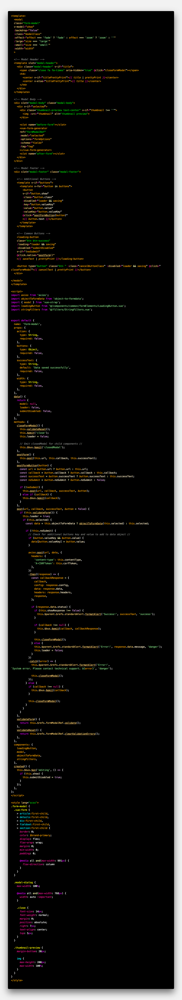
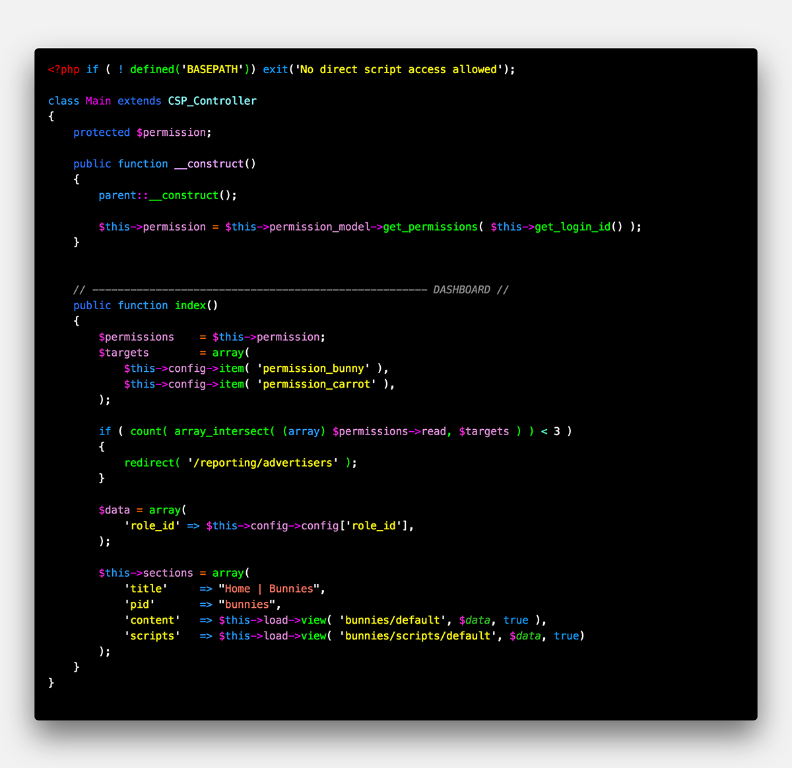

  

  <h1 align="center">Neon Bunny</h1>

  
  &nbsp;
  

  
  &nbsp;
  

## Description

Neon Bunny is a dark (and light) [theme](https://marketplace.visualstudio.com/search?term=bunny&target=VSCode&category=Themes&sortBy=Relevance) for Visual Studio Code even a bunny would love. What does that have to do with bunnies? Only the little fluffy critters know for sure.

## Themes Included

* Neon Bunny
* Neon Bunny - Original
* Neon Bunny - Carrot
* Neon Bunny - White Rabbit

#### Language Support

* JavaScript
* TypeScript
* Vue
* PHP
* HTML
* CSS/SCSS
* Python
* Django

## Screenshots

#### JavaScript

Neon Bunny

Neon Bunny Carrot

#### VUE

Neon Bunny

Neon Bunny Carrot

#### PHP

Neon Bunny

Neon Bunny Carrot

[More Screenshots...](images/screenshots)

## Change Log

[CHANGELOG.MD](CHANGELOG.md)

## License

[LICENSE.MD](LICENSE.md)
