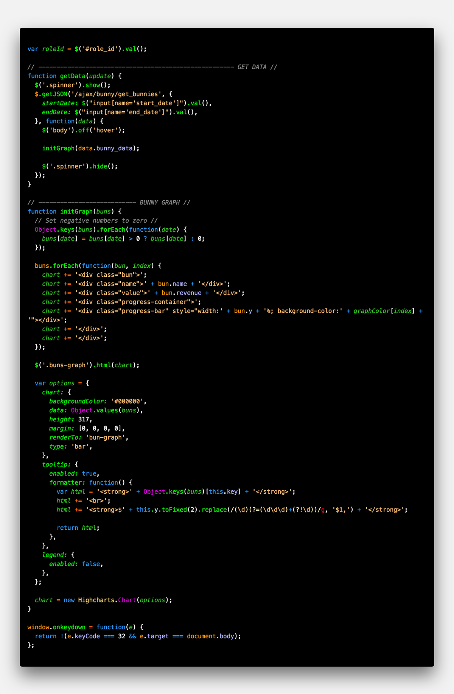
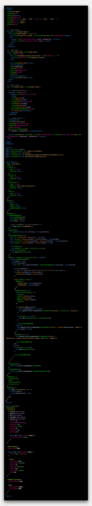

# Neon Bunny

The Neon Bunny theme, is the only bunny [theme](https://marketplace.visualstudio.com/search?term=bunny&target=VSCode&category=Themes&sortBy=Relevance) for VS Code! What does that have to do with bunnies? Only the little fluffy critters know for sure.

[GitHub repository](https://github.com/webdevnerdstuff/neon-bunny-vscode-theme)

## Packaged Themes Included

* Neon Bunny
* Neon Bunny Carrot

#### Language Support

* JavaScript
* Vue
* PHP
* Python
* Django
* HTML
* CSS/SCSS

## Screenshots

#### JavaScript

Neon Bunny

Neon Bunny Carrot

#### VUE

Neon Bunny

Neon Bunny Carrot

#### PHP

Neon Bunny

Neon Bunny Carrot

[More Screenshots...](images/screenshots)

## Change Log

[CHANGELOG.MD](CHANGELOG.md)

## License

[LICENSE.MD](LICENSE.md)
